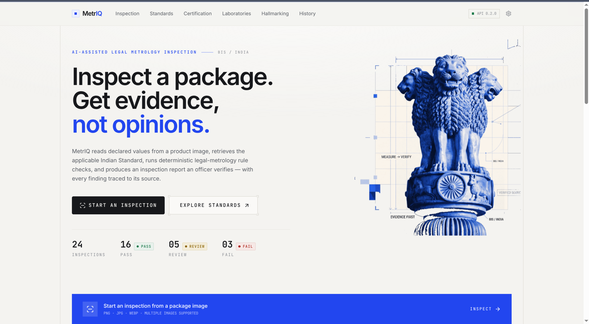
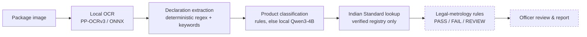
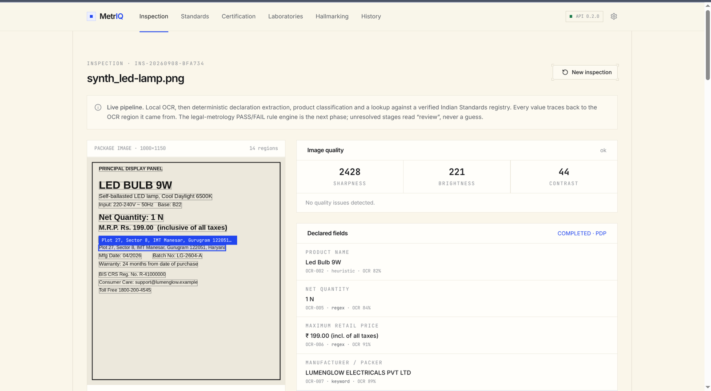
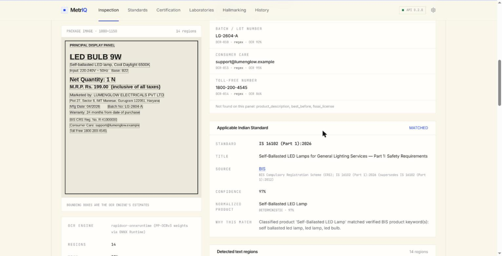
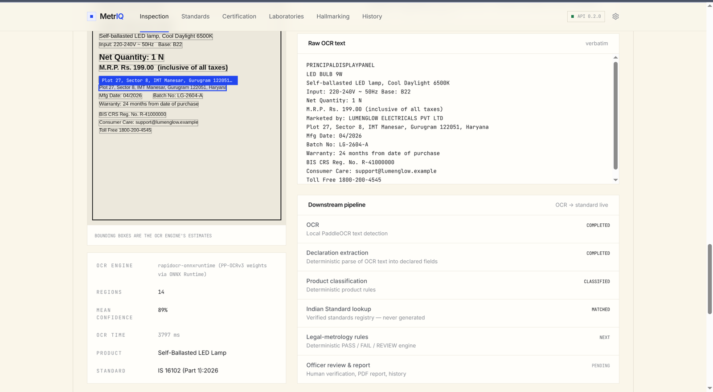
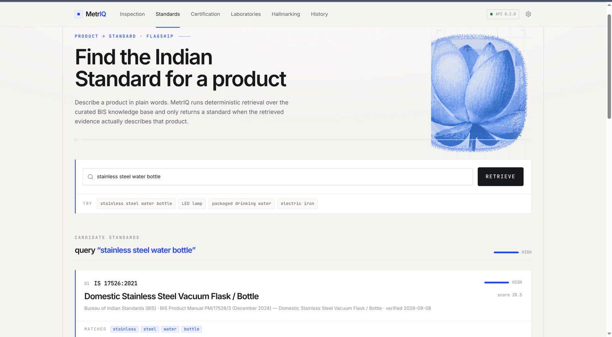
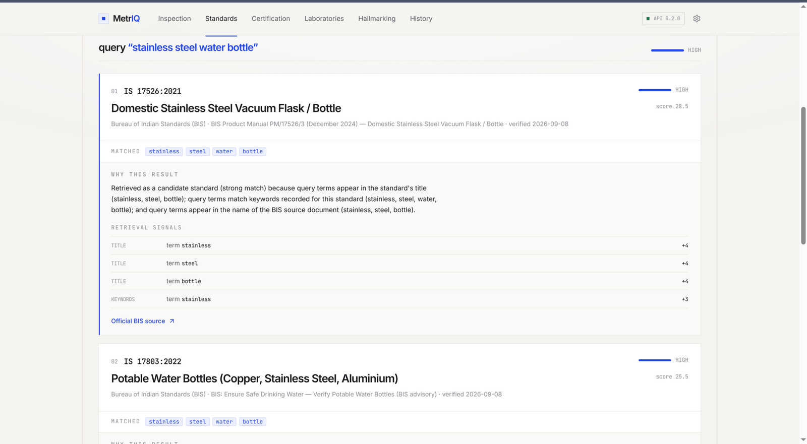

<div align="center">

# MetrIQ

### AI-Assisted Legal Metrology Inspection · Evidence-Backed BIS Assistant

**Point a photo of a product label at MetrIQ. It reads the declared values, works out the applicable Indian Standard, and shows its working — every value traced back to the pixel it came from.**


-111)




</div>

---

## The one rule

> **Retrieved BIS information is the source of truth — not the language model.**

MetrIQ never invents an Indian Standard number, a clause, a fee, a test, or a
compliance outcome. When the evidence is not strong enough, it says **`REVIEW`**
and shows nothing rather than guess. Every screen and every endpoint follows this.

---

## Two halves of one system

| | |
|---|---|
| **① The inspection pipeline** | An uploaded label image → local OCR → deterministic declaration extraction → product classification → a verified Indian Standard. |
| **② The BIS knowledge surfaces** | Natural-language Product → Standard discovery, certification guidance, recognised-lab directories, and hallmarking / HUID information — deterministic retrieval, with a local model that only *explains* what retrieval already found. |

---

## ① The inspection pipeline



`POST /inspection/analyze` (multipart, field `image`) runs everything up to the
Indian Standard. Legal-metrology PASS/FAIL and the officer report are the next
phase — those stages report `NEXT` / `PENDING`, never a fabricated verdict.

### What the officer sees

<table>
<tr>
<td width="50%"><b>Declared fields</b><br/>Each of the 14 legal-metrology fields, with the exact OCR region, bounding box, OCR confidence and extraction method behind it. Click a field → its box lights up on the image.</td>
<td width="50%"><b>Applicable Indian Standard</b><br/>The matched standard, its title, the official BIS source, a real match score, and a plain "why this match" — or an honest <code>REVIEW</code> state.</td>
</tr>
<tr>
<td></td>
<td></td>
</tr>
</table>



### Evidence traceability

```
IMAGE  →  OCR REGION  →  DECLARATION  →  PRODUCT CLASSIFICATION  →  INDIAN STANDARD
        (id + bbox +      (field, value,   ("Roasted Bengal Gram",   (IS 18140:2023,
         confidence)       method)          deterministic / 94%)      verified, 97%)
```

The label may print its own `BIS CRS Reg. No.` or `ISI CM/L` licence — MetrIQ does
**not** read the standard off the label. It classifies the product and matches the
standard from its own verified registry (`data/standards_registry.json`).

### Try it

Sample label images live in [`samples/ocr-labels/`](samples/ocr-labels/):

| Image | Classified as | → Standard |
|---|---|---|
| `synth_clean-declaration.png` | Roasted Bengal Gram | **IS 18140:2023** |
| `synth_led-lamp.png` | Self-Ballasted LED Lamp | **IS 16102 (Part 1):2026** |
| `synth_electric-kettle.png` | Electric Kettle | **IS 367:1993** |
| `synth_low-light-blurry.jpg` | (same, quality flagged low) | still matched |
| `real_*` (Wikimedia Commons) | real-world label photos, incl. hard cases | OCR stress tests |

```bash
curl -s -F "image=@samples/ocr-labels/synth_led-lamp.png" \
  http://127.0.0.1:8000/inspection/analyze | jq '.classification, .standard_match.standard'
```

---

## ② BIS knowledge surfaces

Describe a product in plain words; deterministic retrieval returns candidate
Indian Standards **only when the retrieved BIS evidence actually describes that
product**, each with a "Why this result?" built from real matching signals.

<table>
<tr>
<td width="50%"></td>
<td width="50%"></td>
</tr>
</table>

| Endpoint | What it does | Local model? |
|---|---|---|
| `GET /health` | liveness | — |
| `GET`/`POST /search` | deterministic lexical retrieval over the BIS knowledge base | no |
| `POST /product-standard` | Product → candidate Indian Standard + deterministic "Why this result?" | no |
| `POST /inspection/analyze` | image → OCR → declarations → product → verified Indian Standard | only if rules miss |
| `POST /ask` | grounded BIS Q&A (Hallmarking / HUID screen) | yes |
| `POST /certification-guidance` | grounded BIS certification guidance | yes |
| `POST /laboratory-search` | BIS recognised-lab directories (`explain=false` skips the model) | optional |

The grounded endpoints call a **local** [LM Studio](https://lmstudio.ai) server.
If it is offline, the deterministic endpoints keep working fully and the grounded
ones return a clear `503` — never a fabricated answer.

---

## Architecture

```
backend/                      Python 3.14 · FastAPI
  app/
    ocr.py                    local OCR wrapper (rapidocr-onnxruntime, PP-OCRv3 weights)
    inspection.py             InspectionAnalyzer + response models
    inspection_api.py         POST /inspection/analyze
    declarations.py           deterministic declaration extraction (14 fields)
    classification.py         product classification (rules → local Qwen3-4B)
    standards_registry.py     verified Indian Standard registry + lookup
    pipeline.py               OCR → declarations → product → standard
    retrieval/                deterministic lexical search (text.py, engine.py)
    rag.py                    grounded Q&A (/ask)
    product.py                Product → Standard + "Why this result?"
    certification.py, laboratory.py
    llm.py                    local LM Studio adapter (OpenAI-compatible)
    api.py / main.py          router / app
  tests/                      plain-Python runners, bridged to pytest
data/
  knowledge/                  BIS knowledge base — one JSON file per category (Q&A / retrieval)
  standards_registry.json     hand-verified Indian Standards for Product → Standard
samples/ocr-labels/           sample label images for the inspection pipeline
frontend/                     React 19 · TypeScript · Vite · Tailwind v4
```

**Everything runs locally and free.** No OpenAI / Claude / cloud LLM, no paid OCR,
no paid database. OCR uses the PaddleOCR **PP-OCRv3** weights through ONNX Runtime
(`rapidocr-onnxruntime`) because PaddlePaddle publishes no wheels for Python 3.14;
the models ship in the wheel, so inference is fully offline.

---

## Quickstart

### Backend — Python 3.11+

```bash
cd backend
python3 -m venv .venv
source .venv/bin/activate
pip install -r requirements.txt          # first OCR call also loads the ONNX models (~13 MB, bundled)

uvicorn app.main:app --reload            # http://127.0.0.1:8000
```

- Health: <http://127.0.0.1:8000/health>
- API docs: <http://127.0.0.1:8000/docs>

### Frontend

```bash
cd frontend
npm install
npm run dev                              # http://localhost:5173  (proxies /api → :8000)
```

### Local model (for the grounded endpoints)

Load a small instruction model in [LM Studio](https://lmstudio.ai) (default
`qwen/qwen3-4b`) and start its server on port `1234`. On a laptop, load it with
`--parallel 1`. Override with env vars if needed:

```bash
export LM_STUDIO_BASE_URL=http://127.0.0.1:1234/v1   # default (LLM_BASE_URL also works)
export LM_STUDIO_MODEL=qwen/qwen3-4b                  # default (LLM_MODEL also works)
```

> **Demoing tip.** The fastest, model-free paths are **Product → Standard** and an
> inspection of a known product (deterministic classification, ~3 s). Unknown
> products fall back to the local model, which can take ~25 s on first call.

---

## Tests

```bash
cd backend
./.venv/bin/python -m pytest -q                 # 110 checks, all suites
./.venv/bin/python scripts/check_knowledge.py   # knowledge-base validation

cd ../frontend
npx tsc -b --noEmit                             # type check
npm run build                                   # production build
```

Backend suites are plain-Python runners (each exits non-zero on failure);
`tests/test_plain_runners.py` runs them all under pytest, so `pytest -q` is an
authoritative gate. Model-dependent tests use a stub — no LM Studio needed.

---

## Roadmap

Phases 1–14 are complete (see [`CLAUDE.md`](CLAUDE.md) for the full log). What remains:

- [ ] **Legal-metrology rule engine** — deterministic PASS / FAIL / REVIEW over the extracted declarations against the Packaged Commodities Rules and the matched standard
- [ ] **Officer review & report** — human sign-off, PDF, inspection history (currently placeholder data)

---

## Reference — retrieval scoring

Each query term is matched against a record's fields and the weights are summed
(configurable in `app/retrieval/engine.py`): standard-number match `8` (`12` if the
year also matches), title `4`, keyword `3`, category hint `2`, document name `1.5`,
reference `1`, buried content mention `1`.

**Confidence** of the top hit, from its total score: `high` ≥ 7.5, `medium` ≥ 4.0,
`low` ≥ 1.0, else `none`. If the top hit covers less than ~⅓ of the query terms the
confidence is capped at `low`. When nothing matches: `confidence: "none"`,
`abstained: true`, empty `results` — the system never invents a result.

**Standards registry** ([`app/standards_registry.py`](backend/app/standards_registry.py)):
a match needs a keyword-phrase score ≥ 0.75 **and** a matched phrase of at least two
words, so a single generic word ("water", "gram") can never pull in a standard.
Below threshold → `REVIEW`.
